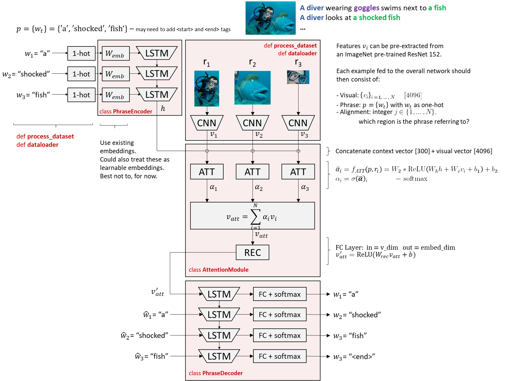

# GroundeR PyTorch Implementation
>*This project is still in development, and so the below description and documentation is also.*

This is a PyTorch implementation of the supervised and unsupervised GroundeR model from [Grounding of Textual Phrases in Images by Reconstruction](https://arxiv.org/abs/1511.03745).

The task is to localize what region of the image, a phrase is referring to. For example, if we have a description "**A man** is jumping over **a fence**" we would like to ground both entities to specific regions of the image. The task of phrase localization or phrase grounding is useful for image captioning and for multi-modal neural machine translation.

## Requisites
Python 3.6  
\- Framework: PyTorch 1.0.1
\- torchvision  
\- Numpy  
\- PIL  
\- pickle  
\- matplotlib  

## Supervised and Unsupervised versions
With reference to the below schematic.

The supervised version of the code assumes we have ground truth of which region in the image the phrase refers to. Therefore the loss is computed as cross-entropy between the visual attention vector  and the one-hot ground truth vector. For a fully unsupervised version there is no need to run the decoder part of the model.

On the other hand, the unsupervised version does not assume we have ground truth of the correct region and therefore relies on the reconstruction loss given by the cross-entropy between the phrase and the output of the decoder.

## Model Design and Architecture
Below is a schematic of the exact implementation (and design decisions) of the code in this repository.

 

